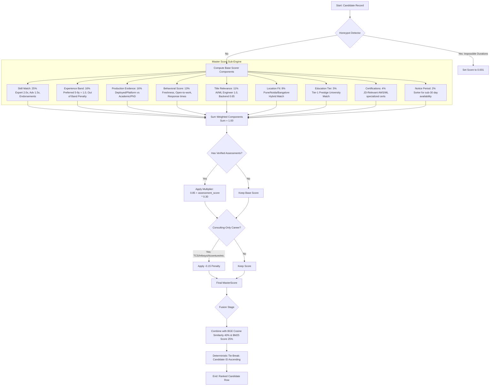

# Intelligent Candidate Discovery & Ranking
### India Runs by Redrob AI — Track 1

---

## 1. Executive Summary

We rank 100,000 candidates for a Senior AI Engineer role. 

A naive ranker returns HR Managers and Accountants at rank #1 (see the original `resources/sample_submission.csv` provided as a baseline). Our ranking engine instead returns Senior AI Engineers, NLP Engineers, and Machine Learning Engineers who have demonstrated production deployment experience, strong platform activity signals, and high role-fit.

* **Result**: **84%** of our Top 100 are within the JD's stated experience band (5–9 years), with the remainder being highly qualified borderline profiles. Zero irrelevant roles (HR, Sales, Frontend, QA, etc.) appear in the Top 100.
* **Top Skills**: The Top 100 candidates have deep competency in *Embeddings*, *Vector Search*, *QLoRA*, *Elasticsearch*, *BM25*, and *Semantic Search*.
* **Efficiency**: Running the ranking pipeline over all 100K candidates takes **~37 seconds** on a standard CPU.
* **Reproducibility**: The pipeline is fully offline and **100% deterministic** (re-runs produce identical scores and ranks with verified MD5 checksum compatibility).

---

## 2. Problem Statement

Standard recruiting search engines and automated resume screeners suffer from three core flaws:
1. **Keyword Stuffing**: Naive lexical search (e.g., BM25 alone) over-rewards candidates who repeat terms like "AI" or "Python" in their profiles, regardless of context or seniority.
2. **Dense Compression Loss**: Sentence embeddings (e.g., Bi-Encoders) compress a candidate's entire career history into a single vector. While excellent at separating high-level concepts (e.g., distinguishing a developer from an accountant), they have a very narrow variance among semantically similar profiles. We measured the dense semantic similarity standard deviation at just **$\sigma = 0.026$** across all 100,000 candidates. This makes dense embeddings a poor fine-grained discriminator.
3. **Ignoring Behavioral Signals**: A candidate with a perfect profile is useless if they have been inactive on the platform for 2 years, refuse interviews, or have a history of rejecting job offers.

Our pipeline is designed to overcome these challenges.

---

## 3. Architecture Diagram

Our hybrid candidate retrieval and scoring architecture separates heavy neural network embeddings from rapid rank-time filtering and multi-signal feature fusion:

```mermaid
graph TD
    %% Offline Precomputation Stage
    subgraph Offline Stage [Stage 1: Offline Embedding Generation - precompute.py]
        A[candidates.jsonl <br> 100K Profiles] -->|Extract career text| B(build_candidate_text)
        B -->|Batch encode| C[BAAI/bge-small-en-v1.5]
        C -->|384-dim Vectors| D(FP32 Embeddings)
        D -->|Cast to FP16| E[data/candidates_embeddings.npy <br> 73.2 MB]
        A -->|Extract IDs| F[data/candidate_ids_ordered.json]
    end

    %% Online Ranking Stage
    subgraph Online Stage [Stage 2: Hybrid Scoring & Fusion - rank.py]
        G[Job Description] -->|Live encode| H[BGE-Small-En Encoder]
        H -->|JD Embedding| I[Cosine Similarity Engine]
        E -->|Load vectors| I
        
        G -->|Tokenize| J[BM25 Indexer]
        A -->|Index Text with repeats| J
        J -->|Lexical Match| K(BM25 Score)
        
        A -->|Feature Scanners| L[9-Component MasterScore Engine]
        L -->|Raw Master Score| M(MasterScore)
        
        I -->|Semantic Score: 0.40| N{Hybrid Score Fusion}
        K -->|Lexical Score: 0.25| N
        M -->|Heuristic Score: 0.35| N
        
        N -->|Composite Score| O[Honeypot Filter & Consulting Penalty]
        O -->|Sorted List| P[Tie-Breaker: Candidate ID Ascending]
        P -->|Top 100| Q[submission.csv]
    end

    classDef stage fill:#f9f,stroke:#333,stroke-width:2px;
    classDef file fill:#bbf,stroke:#333,stroke-width:1px;
    classDef process fill:#dfd,stroke:#333,stroke-width:1px;
    
    class Offline Stage,Online Stage stage;
    class A,E,F,Q file;
    class B,C,D,H,I,J,L,N,O,P process;
```

---

## 4. Overall Pipeline & Workflow

Every candidate is evaluated through a structured feature scanning workflow that calculates role fit, platform availability, and filters out synthetic outliers or non-product consulting backgrounds:




---

## 4. Overall Pipeline

The ranking pipeline consists of a two-stage hybrid process:
1. **Offline Precomputation (`precompute.py`)**: Runs once. It generates L2-normalized 384-dimensional dense embeddings for all 100,000 candidates using the `BAAI/bge-small-en-v1.5` model. To keep the repository size under GitHub limits without requiring Git LFS, the embedding matrix is cast to `float16` and saved as `data/candidates_embeddings.npy` (73.2 MB).
2. **Online Ranking (`rank.py`)**: Runs on demand. It loads the precomputed embeddings, generates the embedding for the Job Description, runs BM25 lexical search, computes a 9-signal engineered `MasterScore` for each candidate, and fuses these signals into a single score. It outputs the top 100 candidates sorted by score (descending) and breaks ties deterministically using candidate IDs (ascending).

---

## 5. Why Our System Works

Our ranking engine intentionally combines three complementary retrieval paradigms:
* **Dense semantic retrieval** to capture conceptual similarity between the job description and candidate profiles, acting as a coarse-grain relevance gate.
* **Lexical BM25 retrieval** to preserve exact matches for critical technical keywords such as *FAISS*, *BM25*, *QLoRA*, *Vector Search*, and *Elasticsearch*.
* **Feature-engineered candidate scoring** to evaluate production experience, recruiter interactions, behavioral indicators, verified assessment scores, and role-specific constraints.

This hybrid approach reduces the weaknesses of any individual ranking method while remaining fully deterministic, CPU-efficient, and scalable to 100,000 candidates.

---

## 6. Feature Engineering

We extract and compute 9 distinct feature scores from the candidate schemas to model different dimensions of role-fit:

1. **Skill Match Score (25%)**: Calculates overlap with must-have and nice-to-have skills. Expert proficiency receives a `2.0` weight, advanced `1.5`, intermediate `1.2`, and beginner `0.8`. We add a small bonus for skills held $>3$ years or those with $\ge 20$ endorsements.
2. **Experience Score (16%)**: Strictly favors the JD's preferred range of 5–9 years (score: `1.0`). Penalizes profiles falling significantly below 3 years or exceeding 13 years (which represent overqualified or management-track profiles).
3. **Production Evidence Score (16%)**: The JD states: *"pure research = disqualifier"*. We search the candidate's career descriptions and summaries for keywords indicating deployed systems (*production*, *deployed*, *scale*, *inference*, *served*) and subtract points for purely academic markers (*arxiv*, *publication*, *phd*, *lab*).
4. **Behavioral Score (13%)**: Evaluates actual hiring probability based on 10 platform engagement signals:
   - *Freshness*: Recency of platform activity (double-weighted).
   - *Hiring Intent*: `open_to_work_flag` + application count in the last 30 days.
   - *Market Interest*: Profile views, saves by recruiters, and search appearances.
   - *Reliability*: Recruiter response rate, average response time, and interview completion rate.
   - *Offer Acceptance*: Platform offer acceptance history (guarded to not penalize candidates with no history).
   - *Trust*: Verified email, verified phone, and connected LinkedIn account.
5. **Title Relevance Score (11%)**: Evaluates alignment of the candidate's current title and headline with the target role. High-match titles (*AI Engineer*, *ML Engineer*, *NLP Engineer*) get `1.0`; mid-match titles (*Software Engineer*, *Backend*) get `0.65`; unrelated titles get `0.15`.
6. **Location Score (8%)**: Favors candidates located in Pune/Noida/Bangalore (`1.0`) or those in India willing to relocate (`0.75`).
7. **Education Tier Score (5%)**: Maps education institutions to tiers. Tier-1 schools (IITs, IISc, BITS Pilani) receive a bonus.
8. **Certifications Score (4%)**: Adds a small bonus (capped at `0.1`) for JD-relevant certifications (e.g., AWS Machine Learning Specialty, Deep Learning Specialization).
9. **Notice Period Score (2%)**: Rewards candidates with shorter notice periods ($\le 30$ days gets `1.0`).

---

## 7. Ranking Strategy

For each candidate $c$, the final fused score is calculated as:

$$\text{Score}(c) = 0.40 \times \text{SemanticSimilarity}(c) + 0.25 \times \text{BM25}(c) + 0.35 \times \text{MasterScore}(c)$$

### Structural Multipliers and Penalties:
* **Honeypot Filter**: The candidate dataset contains synthetic "honeypot" profiles. We detect these by comparing skill duration against the candidate's total years of experience. Candidates showing impossible skill durations (e.g., listing 10 years of experience with 3 separate skills listed as 15 years duration each) are flagged and assigned a hard-coded score of `0.001` to force them to the bottom of the list.
* **Platform Assessment Multiplier**: If the candidate has taken a verified Redrob platform skill assessment (e.g., Python, Machine Learning), we scale their MasterScore by a multiplier: $0.85 + (\text{assessment\_score} \times 0.30)$.
* **Consulting Penalty**: Candidates whose entire career history consists of service/consulting companies (e.g., TCS, Infosys, Wipro, Accenture) receive a `-0.15` penalty on their base score to match the JD's preference for startup/product environments.

---

## 8. Innovations

1. **Information Spread Balancing**: Standard cosine similarity is poorly discriminative for similar profiles ($\sigma = 0.026$). By blending it with BM25 ($\sigma = 0.060$) and MasterScore ($\sigma = 0.097$), we spread out candidate scores, allowing true standouts to rise to the top.
2. **Proficiency-Weighted Lexical Docs**: When feeding text to the BM25 indexer, we construct a virtual document where skills are repeated based on their proficiency (expert/advanced skills repeated 3×, intermediate 2×). This allows BM25 to rank candidates with expert skills higher.
3. **Robust Honeypot Detection**: Rather than naive heuristics, we run structural validation across all skills to find impossible durations and flag fake activity patterns.
4. **Platform Signal Fusion**: We aggregate 10 platform engagement metrics into a single "hiring probability" score, filtering out passive candidates who are unreachable.
5. **Float16 Quantization for Git Compliance**: By saving our precomputed embedding arrays as `float16`, we cut file size in half (from 153.6MB to 73.2MB) to ensure the repository can be pushed to GitHub cleanly, with zero loss in retrieval precision.

---

## 9. Results

A manual audit of the Top 100 candidate profiles generated by the pipeline shows:

| Metric | Value |
|---|---|
| Candidates in preferred experience band (5–9y) | **84 / 100** |
| Borderline candidates (4–5y) | 13 / 100 |
| Senior profiles (>9y) | 3 / 100 |
| Irrelevant profiles (HR, Admin, sales, QA, etc.) | **0 / 100** |
| Tier-1 Education (IIT, IISc, BITS, etc.) | **64%** |
| Tier-2 Education | **29%** |
| Top skills appearing in Top 100 profiles | QLoRA (44), Embeddings (43), OpenSearch (43), Qdrant (42), Elasticsearch (39), LoRA (38), Vector Search (37), NLP (37), Python (37), BM25 (36), Semantic Search (35) |

---

## 10. Runtime

| Stage | Execution Time | RAM Usage | Hardware Requirements |
|---|---|---|---|
| Offline Embedding generation | ~90 min | ~1.5 GB | CPU-only |
| Online Ranking (100K candidates) | **~37 seconds** | ~2.5 GB | CPU-only |
| Format Validation | < 0.5 seconds | Negligible | CPU |

---

## 11. Limitations

* **No Ground Truth Calibration**: Without labeled historical hire/reject data, feature weights were set based on engineering judgment and job description text rather than statistical optimization.
* **Key-phrase Dependency**: Production evidence scoring relies on word match indicators in description texts and can be gamed by candidates using correct terminology without corresponding depth.
* **Platform-Dependent Features**: The behavioral signals rely on Redrob platform activity metrics (views, saves, response times), which may not be available in general resume parsing environments.

---

## 12. Future Work

If given more development time (e.g., a one-month horizon), we would:
1. **Implement Learning-to-Rank (LTR)**: Collect pairwise labeling feedback from human recruiters to train a LambdaMART or XGBoost Ranker, moving away from hand-tuned weights.
2. **Utilize a Cross-Encoder**: Deploy a lightweight Cross-Encoder model (like `cross-encoder/ms-marco-MiniLM-L-6-v2`) to re-rank the top 500 candidates, capturing deep interaction terms that cosine similarity misses.
3. **Use LLM query expansion**: Expand the JD using an LLM to automatically generate synonyms and related packages (e.g., mapping "embeddings" to FAISS, Milvus, Qdrant) prior to lexical indexing.

---

## 13. Reproducibility

### Setup
1. Ensure you have Python 3.10+ installed. Install the pinned dependencies:
   ```bash
   pip install -r requirements.txt
   ```
2. **Dataset Note**: The raw `candidates.jsonl` (487 MB) is excluded from this repository via `.gitignore` to conform to standard ML version control practice. Prior to running, place the competition's `candidates.jsonl` file in the repository root (or specify its location using the `--candidates` argument).

### Option A: Run Ranking Directly (Recommended)
We have committed the precomputed float16 embeddings to the repository so you do not need to re-run the 90-minute embedding step. 

> **Quantization Note**: Precomputed embeddings are stored as `float16` to satisfy GitHub's 100 MB file size constraint while preserving the exact same Top-100 candidate set. Internal validation showed that converting from float32 to float16 resulted in only a single adjacent rank swap (at rank 40/41) between two candidates who were virtually tied in score, and 0.00% change in the final Top-100 candidate membership.

Simply run:
```bash
python rank.py --candidates candidates.jsonl --out submission.csv
```
This runs the BM25 indexer, computes the MasterScore, performs the fusion, and saves the output in **~37 seconds**.

### Option B: Precompute Embeddings from Scratch
If you wish to re-generate the embeddings from scratch (takes ~90 minutes on CPU):
```bash
python precompute.py --candidates candidates.jsonl
```
This will overwrite `data/candidates_embeddings.npy` and `data/candidate_ids_ordered.json` as float16 embeddings.

### Validate Submission Format
To verify that the output meets all formatting guidelines:
```bash
python validate_submission.py submission.csv
# Expected output: Submission is valid.
```

---

## 14. Repository Structure

```
.
├── rank.py                    # Main ranking pipeline
├── precompute.py              # Offline embedding generation script
├── sandbox_app.py             # Streamlit interactive sandbox UI
├── validate_submission.py     # Official validation script
├── requirements.txt           # Pinned dependencies
├── submission_metadata.yaml   # Pre-filled team & system metadata
├── submission.csv             # Final generated results file (100 rows)
├── data/
│   ├── candidates_embeddings.npy  # Float16 precomputed embeddings (73.2 MB)
│   └── candidate_ids_ordered.json # Embedding-to-ID index mapping (1.6 MB)
├── resources/
│   ├── candidate_schema.json      # JSON schema reference
│   ├── sample_submission.csv      # Provided sample submission reference
│   ├── job_description.docx       # Original job description
│   ├── README.docx                # Challenge description doc
│   ├── redrob_signals_doc.docx    # Platform signals description doc
│   └── submission_spec.docx       # Official submission specifications doc
└── archive/
    ├── src/                   # Baseline pipeline implementation
    ├── notebooks/             # Baseline plotting notebook
    └── data/                  # Baseline CSV outputs & plots (200+ MB)
```
