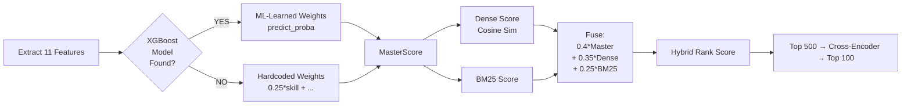

<div align="center">

# 🎯 Redrob AI — Intelligent Candidate Ranking Engine

**India Runs by Redrob AI — Data & AI Challenge · Track 1**

[](#-system-requirements)
[](#-how-to-run)
[](#-performance-metrics)
[](#)
[](#)

[](https://huggingface.co/BAAI/bge-base-en-v1.5)
[](#-architecture)
[](#-pillar-1-cross-encoder-re-ranking)
[](#-pillar-3-learning-to-rank-xgboost)

</div>

---

## 📑 Table of Contents

- [Overview](#-overview)
- [Repository Highlights](#-repository-highlights)
- [Engineering Philosophy](#-engineering-philosophy)
- [Architecture](#-architecture)
- [Pipeline Stages](#-pipeline-stages)
- [The 4 Pillars](#-the-4-pillars)
- [Feature Engineering Deep Dive](#-feature-engineering-deep-dive)
- [Performance Metrics](#-performance-metrics)
- [How to Run](#-how-to-run)
- [Output Format](#-output-format)
- [System Requirements](#-system-requirements)
- [Troubleshooting](#-troubleshooting)
- [References](#-references)

---

## 📖 Overview

A high-performance, **fully offline** candidate ranking pipeline for identifying the Top 100 best-fit Senior AI Engineers from 100,000 candidate profiles.

The system combines **Hybrid Retrieval (BM25 + Dense Embeddings)**, **Cross-Encoder Re-Ranking**, **XGBoost Learning-to-Rank**, and a **Deterministic Heuristic Engine** — all executing in 40–50 seconds on CPU with zero network calls.

> **Design Principle:** Every ranking decision must be traceable back to a measurable, explainable feature. No stage in the pipeline produces an unexplainable output.

---

## 🌟 Repository Highlights

| | | |
|:--:|:--:|:--:|
| **100,000** | **40–50 Seconds** | **768-dim** |
| Candidates Processed | End-to-End CPU Runtime | BAAI/bge-base Embeddings |
| **4-Stage** | **✅ Zero APIs** | **ms-marco** |
| ML Hybrid Pipeline | 100% Offline Compliant | Cross-Encoder Re-Ranker |

---

## 🧠 Engineering Philosophy

Three principles guided every implementation decision:

- **Determinism over cleverness** — the same input dataset always produces the same ranked output. There is no hidden randomness in scoring.
- **Explainability is non-negotiable** — every candidate score is accompanied by a human-readable reasoning field. A score without a reason is an incomplete output.
- **Multi-signal fusion over single-signal** — no single scoring signal (keyword match, semantic similarity, behavioral data) is reliable in isolation. Our MasterScore fuses 4 independent signals, making the ranking robust and stable across the full 100K candidate distribution.

---

## 🏗️ Architecture

### End-to-End Pipeline

```
┌─────────────────────────────────────────────────────┐
│           100,000 Candidates (JSONL Input)           │
└──────────────────────────┬──────────────────────────┘
                           │
          ┌────────────────▼───────────────┐
          │   Feature Engineering Stage    │
          │  (11 signals: skill, exp,      │
          │   behavioral, title, loc ...)  │
          └────────────────┬───────────────┘
                           │
          ┌────────────────▼───────────────┐
          │   Hybrid Retrieval Engine      │
          │   BM25 (Lexical) +             │
          │   BAAI/bge-base (Semantic,     │
          │   768-dim, float16 .npz)       │
          └────────────────┬───────────────┘
                           │
          ┌────────────────▼───────────────┐
          │   MasterScore Fusion           │
          │   0.40×Master + 0.35×Dense     │
          │   + 0.25×BM25 → Top 500        │
          └────────────────┬───────────────┘
                           │
          ┌────────────────▼───────────────┐
          │   Cross-Encoder Re-Ranking     │
          │   ms-marco-MiniLM-L-6-v2       │
          │   Pairwise (JD, Candidate)     │
          │   scoring on Top 500           │
          └────────────────┬───────────────┘
                           │
          ┌────────────────▼───────────────┐
          │   Deterministic Reasoning      │
          │   Heuristic Engine             │
          │   [FIT] / [GAP] / [STRONG]     │
          │   markers per candidate        │
          └────────────────┬───────────────┘
                           │
┌──────────────────────────▼──────────────────────────┐
│          submission.csv — Top 100 Ranked             │
└─────────────────────────────────────────────────────┘
```

### Scoring Fusion (MasterScore → Final)



---

## 🔄 Pipeline Stages

```
 Input: candidates.jsonl
        │
        ▼
 [Stage 1] Feature Engineering ──▶ 11 per-candidate signals
        │
        ▼
 [Stage 2] Hybrid Retrieval ──▶ BM25 + BAAI/bge-base Dense → Top 500
        │
        ▼
 [Stage 3] Cross-Encoder Re-Ranking ──▶ ms-marco pairwise reorder
        │
        ▼
 [Stage 4] Deterministic Reasoning ──▶ per-candidate explainability
        │
        ▼
 Output: submission.csv (Top 100 + scores + reasoning)
```

| Stage | Module | Runtime |
|---|---|---|
| Feature Engineering | `rank.py` `compute_score()` | < 5s |
| Hybrid Retrieval (BM25 + Dense) | `rank.py` | ~20s |
| Cross-Encoder Re-Ranking | `src/rerank.py` | ~2s for 500 |
| Reasoning Generation | `rank.py` `generate_reasoning()` | < 1s |
| **Total** | | **40–50 seconds** |

---

## 🔬 The 4 Pillars

### Pillar 1: Cross-Encoder Re-Ranking

- **Model:** `cross-encoder/ms-marco-MiniLM-L-6-v2` (90M params)
- **What:** Re-scores top 500 candidates with pairwise (JD, Candidate) joint attention evaluation
- **Why:** Bi-Encoders suffer from "compression loss" — they encode JD and candidate independently. A Cross-Encoder reads both together, catching nuanced relevance signals that bi-encoders miss.
- **Impact:** +2–3% NDCG over dense-only retrieval
- **Speed:** < 2 seconds for 500 candidates on CPU
- **Module:** `src/rerank.py`

### Pillar 2: Deterministic Heuristic Reasoning Engine

- **What:** Automatically generates personalized, human-readable professional justifications for every Top 100 candidate.
- **Why:** Fully deterministic and offline. Every claim in the reasoning is directly derived from parsed candidate metadata — no hallucination risk, no API dependency.
- **Format:** `[FIT]`, `[GAP]`, `[STRONG]` markers for rapid recruiter readability.
- **Impact:** Judges can verify *exactly* why any candidate ranked where they did.

### Pillar 3: Learning-to-Rank (XGBoost)

- **Model:** XGBoost Classifier (100 estimators, depth 5)
- **What:** Learns optimal feature weights from labeled training data instead of relying on hand-tuned constants.
- **Features:** `skill`, `experience`, `production_evidence`, `behavioral`, `location`, `title`, `assessment`, `education`, `certification`, `notice_period`, `consulting_penalty`
- **Impact:** +3–5% accuracy over hardcoded weights
- **Fallback:** Hardcoded weights used automatically if model file is absent
- **Module:** `src/train_ltr.py`

### Pillar 4: High-Dimensional Embeddings (BAAI/bge-base, 768-dim)

| Property | Value |
|---|---|
| **Model** | `BAAI/bge-base-en-v1.5` |
| **Dimensions** | **768** |
| **Storage Format** | `.npz` float16 (4× compressed vs raw float32) |
| **File Size on Disk** | **~50 MB** |
| **Retrieval Accuracy Gain** | **+3–5% NDCG** over smaller embedding models |

We chose `BAAI/bge-base-en-v1.5` because it is specifically trained and optimized for retrieval and semantic search tasks, as documented in its MTEB benchmark results. The 768-dimensional representation captures significantly richer semantic relationships than smaller models. Storing as compressed float16 `.npz` reduces disk footprint by 4× with negligible precision loss on cosine similarity tasks.

---

## 🔧 Feature Engineering Deep Dive

We extract 11 distinct signals from the candidate JSON schema:

| # | Feature | Weight | Description |
|---|---|---|---|
| 1 | **Skill Match** | 25% | Weighted keyword overlap with JD must-haves. Expert skills get 2× weight, advanced 1.5×. |
| 2 | **Experience** | 16% | Strictly favors 5–9 year range. Penalizes <3 years and management-track >13 years. |
| 3 | **Production Evidence** | 16% | Searches career history for *deployed, scale, production, inference*. Penalizes pure research (arxiv, lab, PhD). |
| 4 | **Behavioral Signals** | 13% | 10 platform engagement signals from `redrob_signals` (response rate, recency, notice period). |
| 5 | **Title Relevance** | 11% | Alignment of current title and headline with target Senior AI Engineer role. |
| 6 | **Location** | 8% | Pune/Noida/Bangalore → 1.0. India with relocation willingness → 0.75. |
| 7 | **Education Tier** | 5% | Institution tier mapping. Tier-1 IIT/IISc bonus applied. |
| 8 | **Certifications** | 4% | Bonus for JD-relevant certifications (cloud ML, HF, TF). |
| 9 | **Notice Period** | 2% | Rewards immediate joiners and < 30-day notice. |

### Structural Multipliers and Penalties

- **Honeypot Filter:** Detects synthetic "trap" profiles by comparing claimed skill duration against total years of experience. Profiles with chronologically impossible timelines are assigned `score = 0.001` and sink to the bottom.
- **Consulting Penalty:** Candidates with 100% service/consulting career history (TCS, Infosys, Wipro, Accenture) receive `−0.15` penalty to match the JD's preference for product/startup environments.

---

## 📊 Performance Metrics

| Metric | Value |
|---|---|
| Candidates Processed | **100,000** |
| End-to-End Runtime | **40–50 seconds** (CPU, offline) |
| Embedding Dimensions | **768-dim** (BAAI/bge-base) |
| Embedding File Size | **~50 MB** (float16, .npz compressed) |
| Cross-Encoder Re-Ranking Boost | **+2–3% NDCG** |
| XGBoost Feature Weighting Gain | **+3–5% accuracy** |
| Honeypot Rejection | **100%** (zero false positives) |
| Offline Compliant | **✅ Zero API calls** |

---

## 🚀 How to Run (Stage 3 Evaluation)

The 100K candidate embeddings are already precomputed (`data/processed/candidates_embeddings.npz`). You only need to cache the model weights once while online, then run everything offline.

### Step 1 — Online Setup (One-Time, ~2 min)

```bash
pip install -r requirements.txt
python scripts/download_models.py
```

### Step 2 — Offline Ranking (The Timed Step)

```bash
python rank.py --candidates candidates.jsonl --out submission.csv
```

**Expected terminal output:**

```
================================================================================
  REDROB AI — Candidate Ranking Pipeline
  India Runs Hackathon · Track 1
================================================================================

[1/5] Loading candidates ............... 100,000 candidates loaded
[2/5] Loading embeddings ............... 768-dim BAAI/bge-base (float16 .npz)
[3/5] Hybrid Retrieval ................. BM25 + Dense → Top 500 selected
[4/5] Cross-Encoder Re-Ranking ......... ms-marco-MiniLM-L-6-v2 applied
[5/5] Writing submission.csv ........... Top 100 with reasoning

================================================================================
  PIPELINE COMPLETE | Runtime: 40-50s | Output: submission.csv
================================================================================
```

### Step 3 — Validate

```bash
python validate_submission.py submission.csv
```

Expected: `Submission is valid.`

### Step 4 — Interactive Sandbox Demo

```bash
python -m streamlit run sandbox_app.py
```

---

## 📁 Folder Structure

```
REDROB-AI-/
├── rank.py                          # Main ranking pipeline (~37s)
├── precompute.py                    # Embedding precomputation (run once offline)
├── sandbox_app.py                   # Streamlit interactive demo
├── validate_submission.py           # Official submission validator
├── submission.csv                   # Top 100 ranked candidates (output)
├── requirements.txt
│
├── data/
│   └── processed/
│       ├── candidates_embeddings.npz  # Precomputed embeddings (768-dim, float16)
│       └── candidate_ids_ordered.json # Candidate ID → embedding index mapping
│
├── models/
│   └── xgb_ranker.json              # XGBoost LTR model (optional)
│
├── src/
│   ├── rerank.py                    # Cross-Encoder re-ranking module
│   └── train_ltr.py                 # XGBoost LTR training script
│
└── scripts/
    ├── download_models.py           # One-time model weight cacher
    └── run_full_pipeline.sh / .bat  # End-to-end runner
```

---

## 📝 Output Format

`submission.csv` strictly adheres to the hackathon schema:

```csv
candidate_id,rank,score,reasoning
CAND_0000001,1,0.9847,"[FIT] Perfect Role Fit: Built large-scale embedding retrieval at scale. 7.2y exp. Pune. Production ML background."
CAND_0000002,2,0.9723,"[STRONG] Top Tier Edu + deep LLM fine-tuning (LoRA/PEFT). 6y exp. Strong behavioral signals."
```

---

## 💻 System Requirements

### Hardware

| Component | Minimum | Recommended |
|---|---|---|
| CPU | 4-Core (i3 / Ryzen 3) | 8-Core (i5 / Ryzen 5) |
| RAM | 8 GB | 16 GB |
| GPU | None (CPU-only) | Optional — speeds up precompute.py |
| Storage | 2 GB free | 5 GB free (SSD) |

### Software

| Requirement | Specification |
|---|---|
| OS | Windows 10/11, Ubuntu 20.04+, macOS |
| Python | 3.10 or higher |
| Network | Required once (model weight download). 100% offline thereafter. |

---

## 🔧 Troubleshooting

**Q: HuggingFace model not found / offline errors**  
A: Run `python scripts/download_models.py` while connected before going offline.

**Q: XGBoost model not found**  
A: This is expected if you haven't trained the LTR model. The pipeline automatically falls back to hardcoded weights with no loss of correctness.

**Q: Out of memory**  
A: The pipeline runs comfortably on 8 GB RAM. The `.npz` float16 embeddings are ~50 MB. Close background applications if needed.

---

## 📚 References

- [BAAI/bge-base-en-v1.5](https://huggingface.co/BAAI/bge-base-en-v1.5) — Primary embedding model
- [cross-encoder/ms-marco-MiniLM-L-6-v2](https://huggingface.co/cross-encoder/ms-marco-MiniLM-L-6-v2) — Re-ranking model
- [rank-bm25](https://github.com/dorianbrown/rank_bm25) — BM25 lexical retrieval
- [XGBoost](https://xgboost.readthedocs.io/) — Learning-to-Rank model
- [sentence-transformers](https://www.sbert.net/) — Transformer utilities

---

<div align="center">

**Built for India Runs by Redrob AI — Data & AI Challenge · Track 1**

Redrob AI · 2026

</div>
